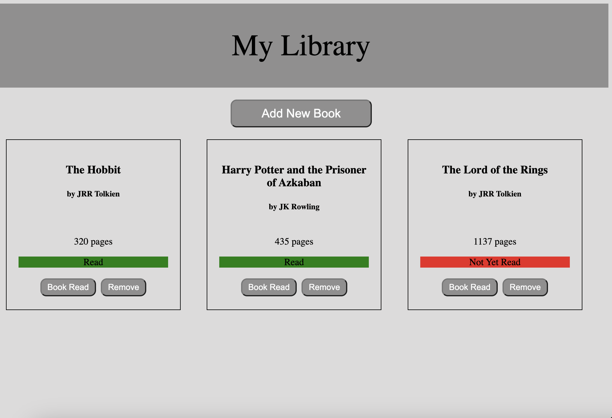
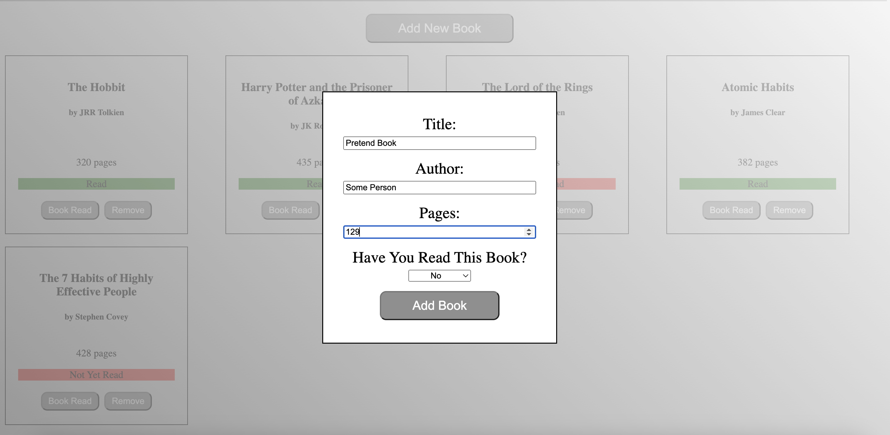
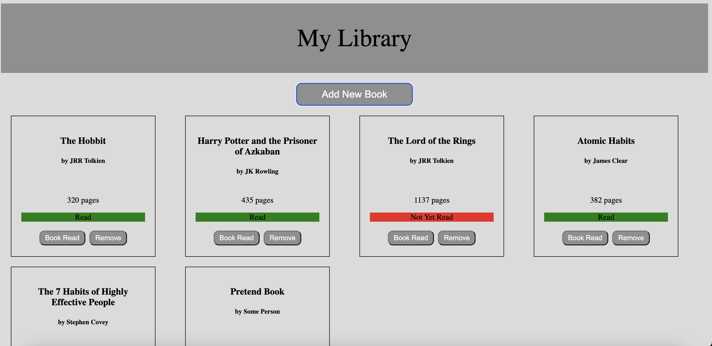
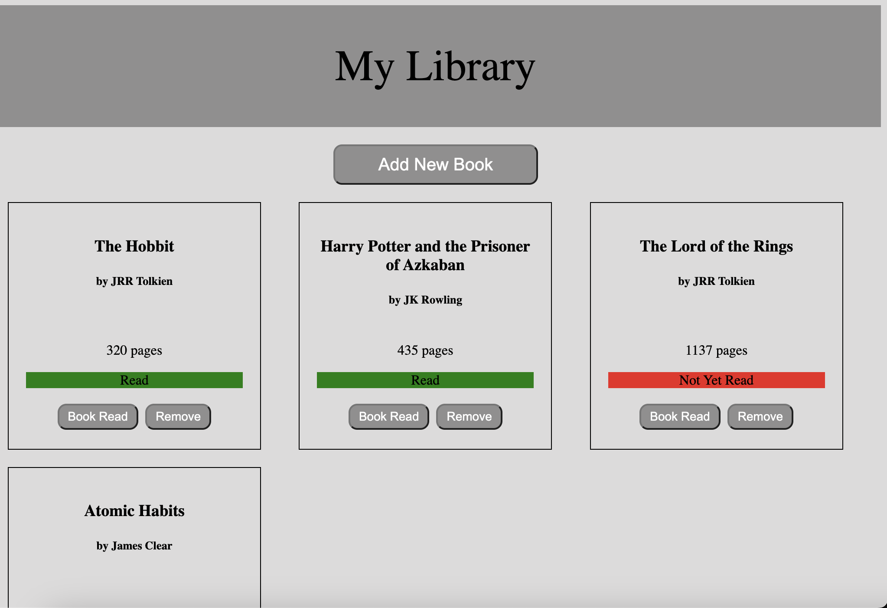

# Admin Dashboard
## Project 8: Library App Built Using JavaScript, CSS, and HTML

## Description: 
Welcome to my eighth web development project! This is part of my coursework in The Odin Project, a free, open-source curriculum to learn fullstack web development! 

This project was built in JavaScript, CSS, and HTML! 

The task for this project was to build a small Library app. I decided to expand this just for fun! I hope you enjoy! 

## Links:
The full challenge description can be found here: https://www.theodinproject.com/lessons/node-path-javascript-library#project-solution. 

## Screenshots: 

